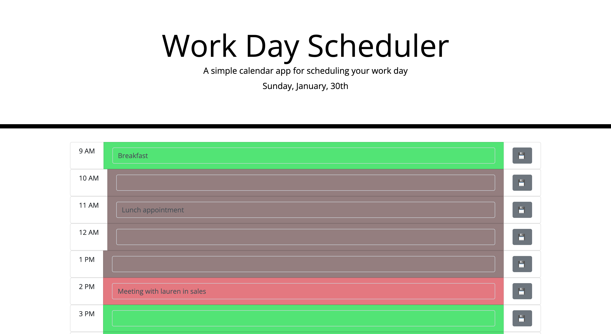

# DayPlanner

DayPlanner is a web app based on Jquery, boostrap, and html code that creates a functional way for you to track your schedule

## Installation

you can access the live URL for this web app at https://elbashadore.github.io/Day-Planner/

## Visuals

# Day-Planner
